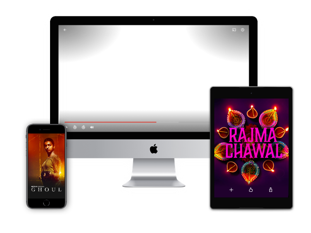

# 🎬 Netflix Website Clone

A simple Netflix landing page clone built using **HTML** and **CSS**.

## 🚀 Live Demo

🔗 https://netflix-website-clone-amber.vercel.app

---

## ✨ Features

- Netflix-inspired UI
- Responsive Design
- Modern Layout
- Hero Section
- FAQ Section
- Clean User Interface

---

## 🛠️ Technologies Used

- HTML5
- CSS3

---

## 📂 Project Structure

| File | Description |
|--------|------------|
| index.html | Main webpage |
| style.css | Styling file |
| logo.png | Netflix logo |
| tv.png | TV image |
| 1.jpg - 4.png | Project assets |
| 1.m4v - 2.m4v | Video assets |

---

## 🖼️ Preview

<p align="center">
  
</p>

---

## ⚡ Getting Started

### Clone the Repository

```bash
git clone https://github.com/Prateekcodex/Netflix-website-clone.git
```

### Run the Project

Open `index.html` in your browser.

---

## 👨‍💻 Author

**Prateek Patel**

- GitHub: https://github.com/Prateekcodex

---

## ⭐ Support

If you like this project, don't forget to ⭐ the repository.
